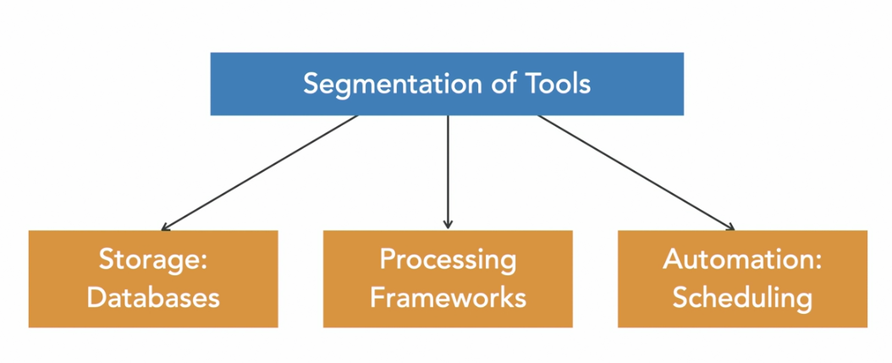
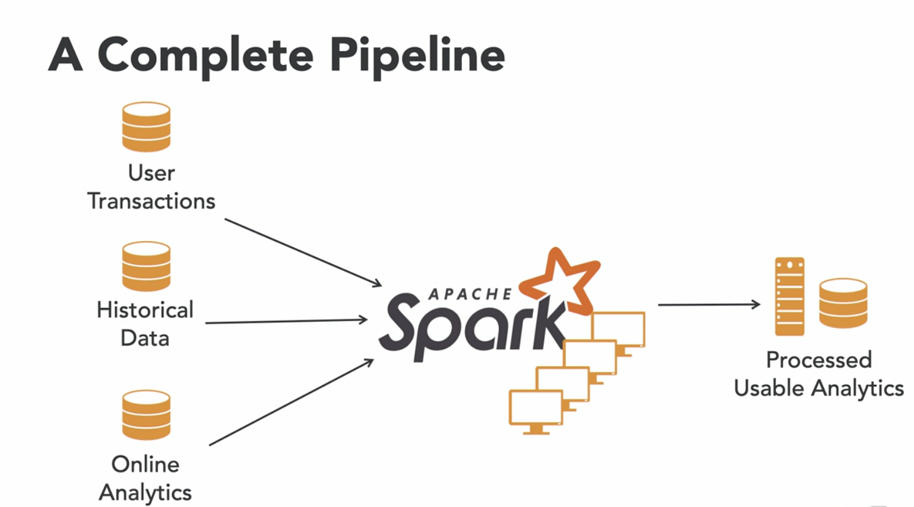

# Data Engineering Foundations

### 1. What is Data Engineering?

A type of software engineering that focuses on the designing, developing, testing, and maintaining architectures, such
as databases and large-scale processing systems.

The work of the data engineer is basically to move data from transactional databases to analytical databases to make
life easier for the data scientist.

| Online Transaction Processing (OLTP) | Online Analytical Processing (OLAP) |
|--------------------------------------|-------------------------------------|
| Application databases                | Analytical database                 |
| Many transactions                    | Aggregate queries                   |
| Row oriented                         | Column oriented                     |
| Stored per record                    | Parallelization                     |

_Fig. 1: Segmentation of tools in data engineering_

_Fig. 2: Common data engineering tools_

### 2. Challenges in a Data-Driven Organization

- Data is scattered
- Slow and blunt analyses due to inefficient data storage
- Legacy code corrupting files
- Manual and repetitive tasks that slow work down

### 3. The Role of a Data Engineer

- Gather data from different sources
- Optimize databases for analyses
- Remove corrupt files and repair the data pipeline
- Automate tasks and pipelines that store data in suitable format

### 4. Data Engineer vs. Data Scientist

| Data Engineer                                   | Data Scientist                          |
|-------------------------------------------------|-----------------------------------------|
| Develop robust and scalable data architecture   | Mine data for patterns                  |
| Streamline data collection and storage          | Model using statistics                  |
| Clean corrupt data                              | Clean outliers                          |
| Comprehend cloud technology                     | Comprehend predictive modeling using ML |
| Maintain processes for coherent data management | Monitor business processes and metrics  |

### 5. Essential Tools for Data Engineers

#### 5.1. Storage Databases

- Used to hold large amounts of data
- Support for applications and analyses
- Can be SQL or NoSQL (`MySQL`, `PostgreSQL`, `MongoDB` )

#### 5.2. Processing Frameworks

- Data cleaning
- Data aggregation
- Data clustering
- Batch and stream processing
- Examples include: `Spark`, `Hive`, `Flink` and `Kafka`

#### 5.3. Automation Scheduling

These ensure that data moves from one place to another at a set time. They are used to:

- Set up and manage workflows
- Plan jobs with specific intervals
- Resolve dependency requirements of jobs
- Examples include: `Airflow`, `Oozie` and `Luigi`

_Fig. 3: A data pipeline_
