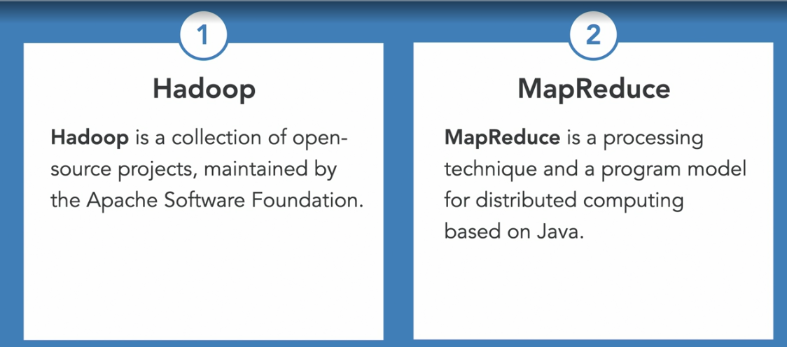
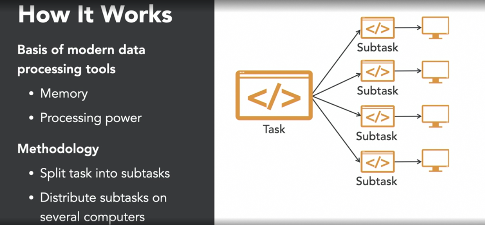
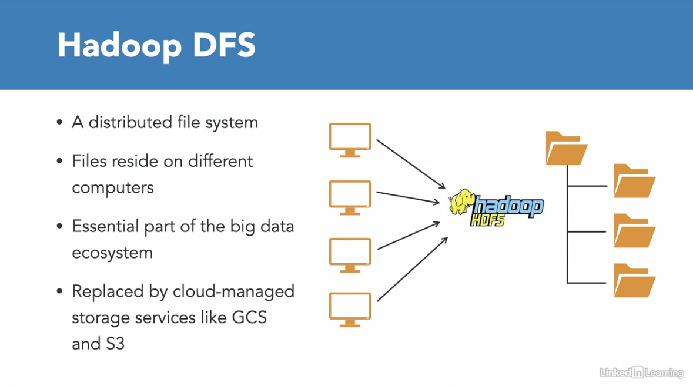
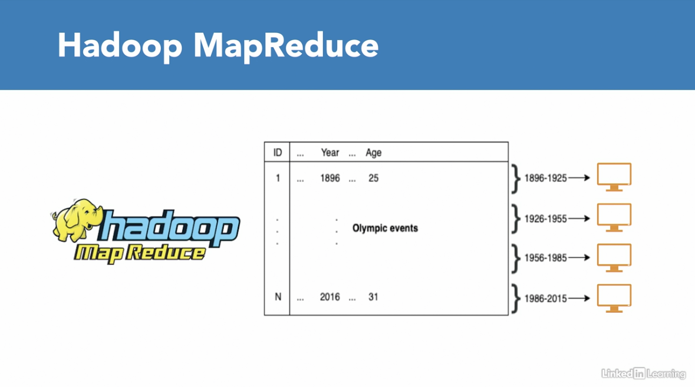
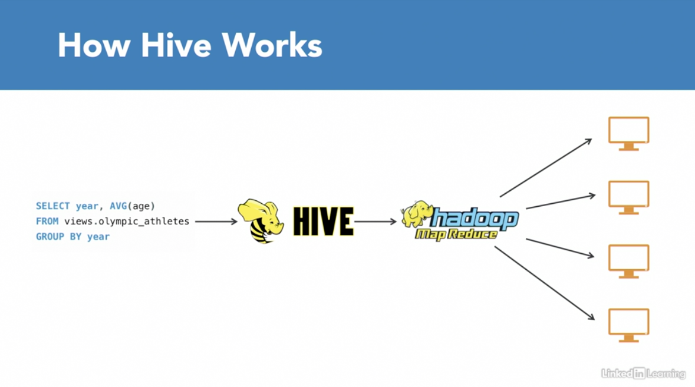

# Data Engineering Foundations

### 1. What is Data Engineering?

A type of software engineering that focuses on the designing, developing, testing, and maintaining architectures, such
as databases and large-scale processing systems.

The work of the data engineer is basically to move data from transactional databases to analytical databases to make
life easier for the data scientist.

| Online Transaction Processing (OLTP) | Online Analytical Processing (OLAP) |
|--------------------------------------|-------------------------------------|
| Application databases                | Analytical database                 |
| Many transactions                    | Aggregate queries                   |
| Row oriented                         | Column oriented                     |
| Stored per record                    | Parallelization                     |

_Fig. 1: Segmentation of tools in data engineering_

_Fig. 2: Common data engineering tools_

### 2. Challenges in a Data-Driven Organization

- Data is scattered
- Slow and blunt analyses due to inefficient data storage
- Legacy code corrupting files
- Manual and repetitive tasks that slow work down

### 3. The Role of a Data Engineer

- Gather data from different sources
- Optimize databases for analyses
- Remove corrupt files and repair the data pipeline
- Automate tasks and pipelines that store data in suitable format

### 4. Data Engineer vs. Data Scientist

| Data Engineer                                   | Data Scientist                          |
|-------------------------------------------------|-----------------------------------------|
| Develop robust and scalable data architecture   | Mine data for patterns                  |
| Streamline data collection and storage          | Model using statistics                  |
| Clean corrupt data                              | Clean outliers                          |
| Comprehend cloud technology                     | Comprehend predictive modeling using ML |
| Maintain processes for coherent data management | Monitor business processes and metrics  |

### 5. Essential Tools for Data Engineers

#### 5.1. Storage Databases

- Used to hold large amounts of data
- Support for applications and analyses
- Can be SQL or NoSQL (`MySQL`, `PostgreSQL`, `MongoDB` )

#### 5.2. Processing Frameworks

- Data cleaning
- Data aggregation
- Data clustering
- Batch and stream processing
- Examples include: `Spark`, `Hive`, `Flink` and `Kafka`

#### 5.3. Automation Scheduling

These ensure that data moves from one place to another at a set time. They are used to:

- Set up and manage workflows
- Plan jobs with specific intervals
- Resolve dependency requirements of jobs
- Examples include: `Airflow`, `Oozie` and `Luigi`

_Fig. 3: A data pipeline_

### 6. Databases

A database is large collection of data organized in efficient structures and formats to support rapid search and
retrieval. A database:

- Holds data
- Organizes data
- Helps in the search and retrieval of data

#### 6.1. Differences between a database and a file system

The main difference between a database and a simple file system is the level of organization and the fact that
databases abstract/extrapolate a lot of data operations like search, replication, indexing.

| Databases                                                 | File System                    |
|-----------------------------------------------------------|--------------------------------|
| Efficiently organized                                     | Less organized                 |
| Offers functionalities like search, replication, indexing | Offers minimal functionalities |

#### 6.2. Types of Data

**Structured Data:**  An example is a tabular data in a relational database.

**Semi-structured data:**  This is a form of structured data but does not follow the tabular structure of data models
associated with relational databases. It contains tags or other markers like key-value pairs to separate semantic
elements and enforce hierarchies or records and feeds within the data. An example is JSON data.

**Unstructured Data:** This could be photos or videos

#### 6.3. Database Schema

A database schema describes the structure and relationships between tables of a database. The formal definition of a
database schema is a set of formulas(sentences) called `integrity constraints` imposed on a database. These constraints
ensure compatibility between parts of the schema.

Examples include the **star schema** which consists of one or more fact tables referencing any number of dimension
tables.

NB: Designing a database schema is the first step in building a data pipeline and often requires a lot of planning since
an ineffective schema can lead to database that consumes a lot of memory and resources.

### 7. Distributive Computing

When big data processing tools perform a processing task, they split it up into several smaller subtasks. The processing
tools then distribute these subtasks over several computers, usually cheap commodity computers. Individually, all these
computers would take long time to process the complete task. However, since all the computers work in parallel on
smaller subtasks, the task in its whole is completed faster.

The obvious benefit of having multiple processing units is extra processing power. However, another more impactful
benefit of parallel computing is that instead of needing to load all the data in one computer's memory, you can
partition the data and load the subsets into memory of different computers. That means the memory footprint per computer
is relatively small and the data can fit in the memory closest to the processor, the RAM. This reduces the cost and
helps in fault tolerance.

This however, also comes at a cost. Splitting a task into subtasks and merging the results of the subtasks back into one
final result requires some communication between processes. This communication overhead can become a bottleneck, if the
processing requirements are not substantial, or if you have too little processing units.

In other words, if you have two processing units, a task that takes a few hundred milliseconds might not be worth
splitting up. Additionally, due to the overhead, the speed does not increase linearly, an effect also known
as `parallel slow down`

_Fig. 4: Distributive Computing_

### 8. Data Engineering Tools

Hadoop

_Fig. 5: Hadoop DFS_

_Fig. 6: Hadoop MapReduce_

_Fig. 7: How Hive Works_

#### Spark

- Distributes data processing tasks between clusters of computers
- Sparks solves the problem of expensive disk writes between jobs in `MapReduce` based systems by keeping as much
  processing as possible in memory.
- This was especially seen in interactive exploratory data analysis, where each step builds on top of a previous step.
- Processing is done in memory
- Faster processing as it avoids disk writes
- It relied on resilient distributed datasets (RDDs)
- RDDs allow two types of operations: _transformations_ and _actions_. Transformations are functions like `filter`
  , `map`, `groupBy` and `union` while actions are functions like `count`, `first`, `collect` and `reduce`.
- Spark can be 100X faster than Hadoop for large scale data processing.

_Fig. 8: Transformations vs. Actions_

